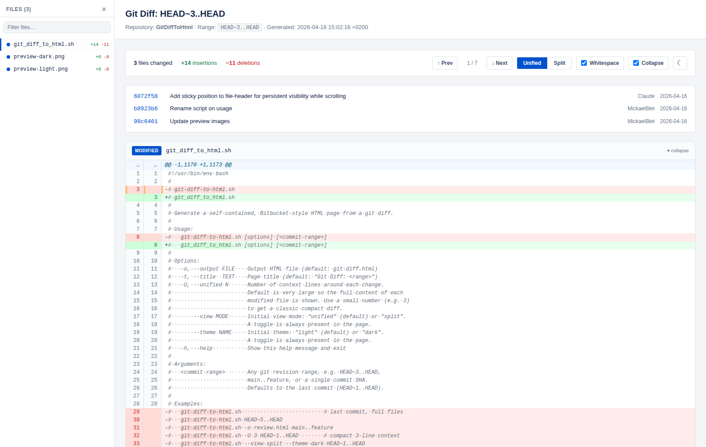
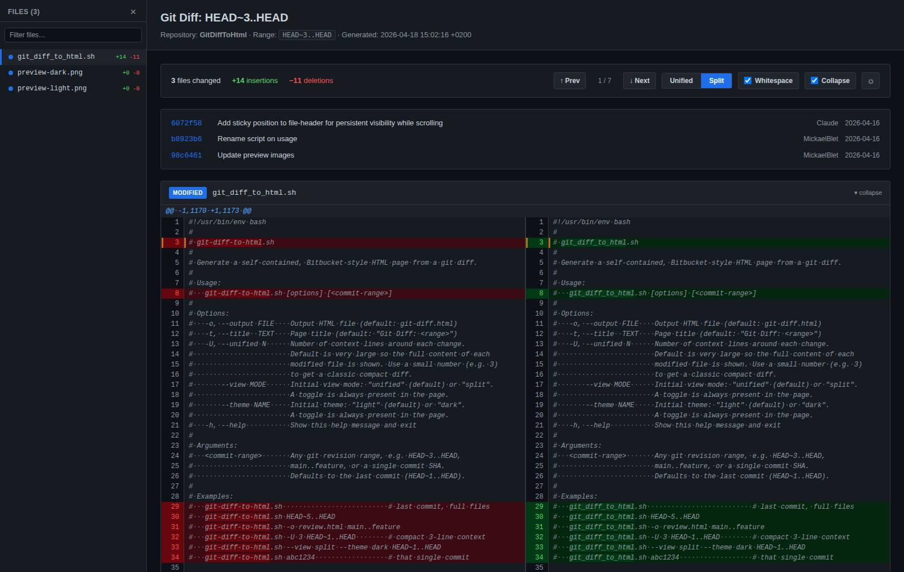

# GitDiffToHtml

A single Bash script that generates self-contained, Bitbucket-style HTML pages from any `git diff`.

No dependencies beyond `git` and `bash`.

## Preview

| Light (Unified) | Dark (Split) |
|:---:|:---:|
|  |  |

## Features

- **Self-contained HTML** -- single file, no external dependencies
- **Unified & Split views** -- toggle between views in the browser
- **Light & Dark themes** -- toggle in the browser or set via CLI
- **File sidebar** -- left panel for fast navigation between files
- **Sticky file header** -- stays visible while scrolling through long diffs
- **Prev/Next navigation** -- floating buttons to jump between changes
- **Collapsible files** -- collapse/expand individual file diffs
- **Collapse unchanged** -- fold long unchanged regions, toggle in the browser or via CLI
- **Whitespace markers** -- visualize spaces/tabs, toggle in the browser or via CLI
- **Commit log** -- shows commit SHAs, messages, authors, and dates
- **Full file or compact diff** -- use `-U` to control context lines

## Installation

```bash
# Clone and add to PATH
git clone https://github.com/MickaelBlet/GitDiffToHtml.git
export PATH="$PATH:$(pwd)/GitDiffToHtml"

# Or just copy the script
curl -o git_diff_to_html.sh https://raw.githubusercontent.com/MickaelBlet/GitDiffToHtml/master/git_diff_to_html.sh
chmod +x git_diff_to_html.sh
```

## Usage

```bash
# Last commit, full file context
git_diff_to_html.sh

# Specific range
git_diff_to_html.sh HEAD~5..HEAD

# Custom output file
git_diff_to_html.sh -o review.html main..feature

# Compact 3-line context diff
git_diff_to_html.sh -U 3 HEAD~1..HEAD

# Dark theme, split view
git_diff_to_html.sh --view split --theme dark HEAD~1..HEAD

# Single commit
git_diff_to_html.sh abc1234
```

## Options

| Option | Description | Default |
|--------|-------------|---------|
| `-o, --output FILE` | Output HTML file | `git-diff.html` |
| `-t, --title TEXT` | Page title | `Git Diff: <range>` |
| `-U, --unified N` | Context lines around each change | Full file |
| `--view MODE` | Initial view: `unified` or `split` | `unified` |
| `--theme NAME` | Initial theme: `light` or `dark` | `light` |
| `--whitespace STATE` | Initial whitespace markers: `on` or `off` | `on` |
| `--collapse STATE` | Initial collapse-unchanged: `on` or `off` | `on` |
| `-h, --help` | Show help | |

## License

[MIT](LICENSE) -- Mickael Blet
