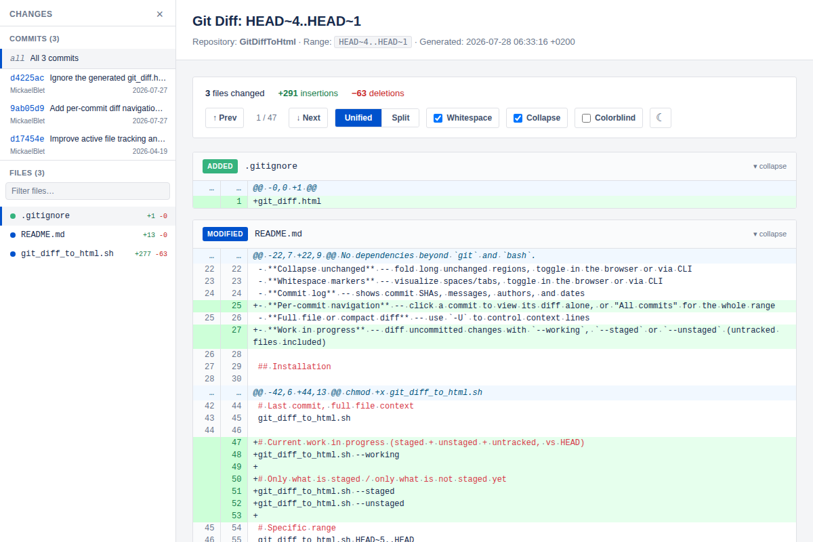
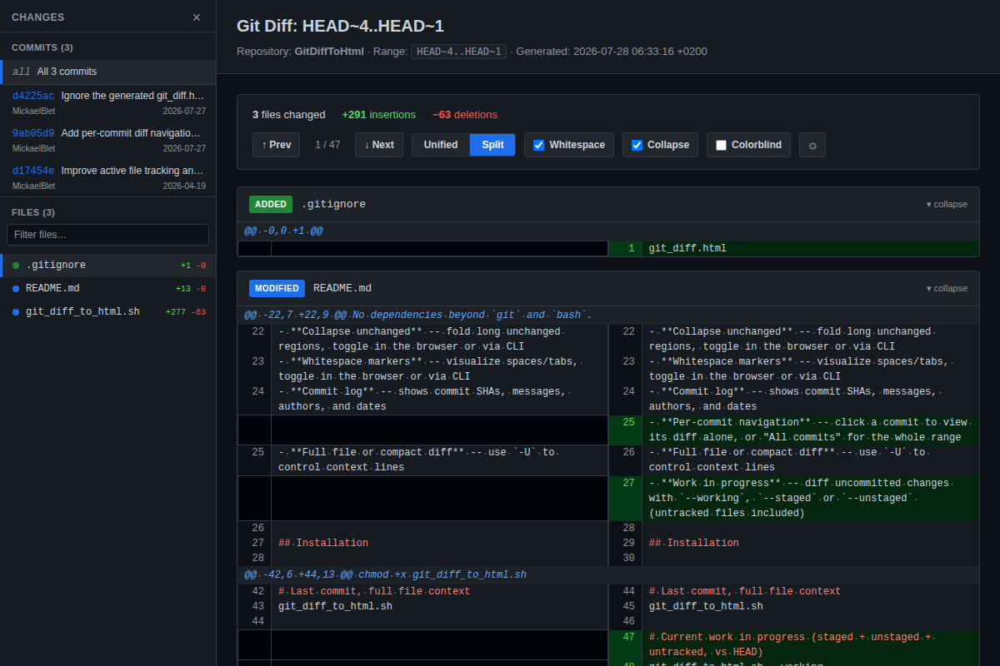

# GitDiffToHtml

A single Bash script that generates self-contained, Bitbucket-style HTML pages from any `git diff`.

No dependencies beyond `git`, `bash` and `awk`.

## Preview

| Light (Unified) | Dark (Split) |
|:---:|:---:|
|  |  |

## Features

- **Self-contained HTML** -- single file, no external dependencies
- **Unified & Split views** -- toggle between views in the browser
- **Light & Dark themes** -- toggle in the browser or set via CLI
- **Colorblind-safe palette** -- blue/orange add & delete colors for both themes, toggle in the browser or `--colorblind on`
- **Sidebar** -- left panel listing commits and files for fast navigation
- **Sticky file header** -- stays visible while scrolling through long diffs
- **Word-level diff** -- highlights what actually changed inside a modified line
- **Syntax highlighting** -- per-language colors, detected from the file extension
- **Copy-friendly** -- `+`/`-` markers and whitespace dots are never part of a copied selection
- **Prev/Next navigation** -- floating buttons to jump between changes
- **Collapsible files** -- collapse/expand individual file diffs
- **Collapse unchanged** -- fold long unchanged regions, toggle in the browser or via CLI
- **Whitespace markers** -- visualize spaces/tabs, toggle in the browser or via CLI
- **Commit log** -- sidebar section with commit SHAs, messages, authors, and dates
- **Per-commit navigation** -- click a commit to view its diff alone, or "All commits" for the whole range
- **Full file or compact diff** -- use `-U` to control context lines
- **Work in progress** -- diff uncommitted changes with `--working`, `--staged` or `--unstaged` (untracked files included)

## Installation

```bash
# Clone and add to PATH
git clone https://github.com/MickaelBlet/GitDiffToHtml.git
export PATH="$PATH:$(pwd)/GitDiffToHtml"

# Or just copy the script
curl -o git_diff_to_html.sh https://raw.githubusercontent.com/MickaelBlet/GitDiffToHtml/master/git_diff_to_html.sh
chmod +x git_diff_to_html.sh
```

## Usage

```bash
# Last commit, full file context
git_diff_to_html.sh

# Current work in progress (staged + unstaged + untracked, vs HEAD)
git_diff_to_html.sh --working

# Only what is staged / only what is not staged yet
git_diff_to_html.sh --staged
git_diff_to_html.sh --unstaged

# Specific range
git_diff_to_html.sh HEAD~5..HEAD

# Custom output file
git_diff_to_html.sh -o review.html main..feature

# Compact 3-line context diff
git_diff_to_html.sh -U 3 HEAD~1..HEAD

# Dark theme, split view
git_diff_to_html.sh --view split --theme dark HEAD~1..HEAD

# Single commit
git_diff_to_html.sh abc1234
```

## Options

| Option | Description | Default |
|--------|-------------|---------|
| `-w, --working` | Diff uncommitted changes (staged + unstaged) against `HEAD` | |
| `--staged`, `--cached` | Diff staged changes only (index vs `HEAD`) | |
| `--unstaged` | Diff unstaged changes only (work tree vs index) | |
| `--untracked STATE` | Include untracked files (`--working` / `--unstaged`): `on` or `off` | `on` |
| `-o, --output FILE` | Output HTML file | `git_diff.html` |
| `-t, --title TEXT` | Page title | `Git Diff: <range>` |
| `-U, --unified N` | Context lines around each change | Full file |
| `--view MODE` | Initial view: `unified` or `split` | `unified` |
| `--theme NAME` | Initial theme: `light` or `dark` | `light` |
| `--whitespace STATE` | Initial whitespace markers: `on` or `off` | `on` |
| `--collapse STATE` | Initial collapse-unchanged: `on` or `off` | `on` |
| `--colorblind STATE` | Colorblind-safe palette (blue/orange instead of green/red): `on` or `off` | `off` |
| `-h, --help` | Show help | |

## License

[MIT](LICENSE) -- Mickael Blet
